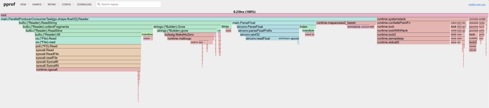
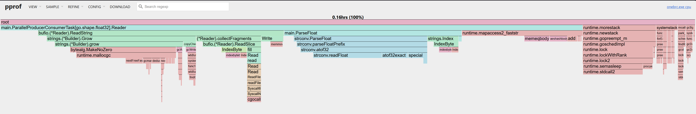
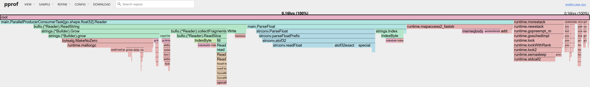
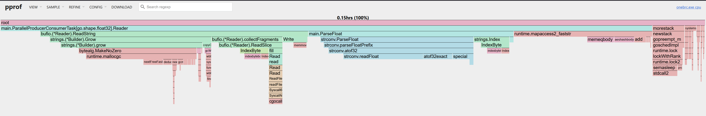
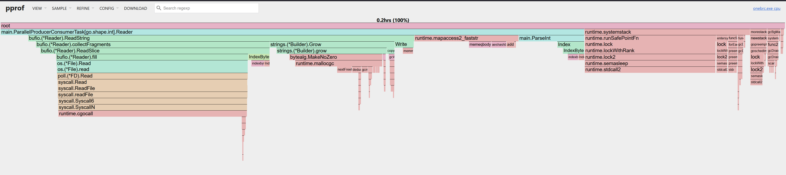
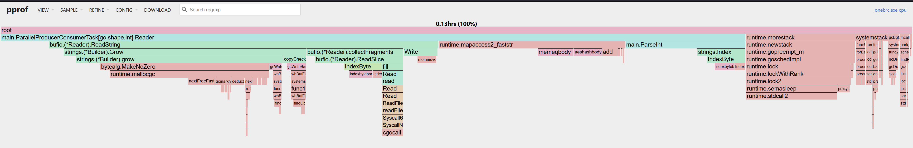
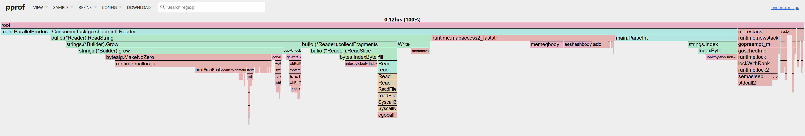
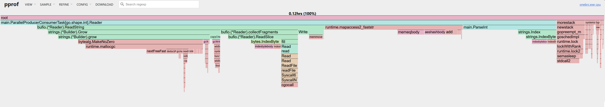

## Parallel Producer-Consumer

### strconv.ParseFloat

___

#### Buffer size 1024:

Read Speed: ~0 MB/s - should be something with metrics reporting in win 10

| buffer size | 1024 bytes | 
|-------------|------------|
| Min         | 22.306s    |
| Max         | 22.970s    |
| Avg         | 22.482s    |

**CPU Profiling Flame Graph**:

#### Buffer size 128kb

Read Speed: ~0 MB/s

| buffer size | 128 KBytes | 
|-------------|------------|
| Min         | 15.345s    |
| Max         | 15.597s    |
| Avg         | 15.459s    |

**CPU Profiling Flame Graph**:

#### Buffer size 256kb:

Read Speed: ~0 MB/s

| buffer size | 256 KBytes | 
|-------------|------------|
| Min         | 14.675s    |
| Max         | 15.006s    |
| Avg         | 14.805s    |

**CPU Profiling Flame Graph**:

#### Buffer size 1mb:

Read Speed: ~0 MB/s

| buffer size | 1 MBytes | 
|-------------|----------|
| Min         | 12.868s  |
| Max         | 13.525s  |
| Avg         | 13.231s  |

**CPU Profiling Flame Graph**:

#### Buffer size 2mb:

Read Speed: ~0 MB/s

| buffer size | 2 MBytes | 
|-------------|----------|
| Min         | 12.420s  |
| Max         | 13.926s  |
| Avg         | 13.621s  |

**CPU Profiling Flame Graph**:

___

### ParseInt

#### Buffer size 1024:

Read Speed: ~0 MB/s - should be something with metrics reporting in win 10

| buffer size | 1024 bytes | 
|-------------|------------|
| Min         | 19.052     |
| Max         | 19.199s    |
| Avg         | 19.114s    |

**CPU Profiling Flame Graph**:

#### Buffer size 128kb

Read Speed: ~0 MB/s

| buffer size | 128 KBytes | 
|-------------|------------|
| Min         | 12.357s    |
| Max         | 12.498s    |
| Avg         | 12.735s    |

**CPU Profiling Flame Graph**:

#### Buffer size 1mb:

Read Speed: ~0 MB/s

| buffer size | 1 MBytes | 
|-------------|----------|
| Min         | 10.162s  |
| Max         | 10.485s  |
| Avg         | 10.280s  |

**CPU Profiling Flame Graph**:

#### Buffer size 2mb:

Read Speed: ~0 MB/s

| buffer size | 2 MBytes | 
|-------------|----------|
| Min         | 9.561s   |
| Max         | 10.036s  |
| Avg         | 9.776s   |

**CPU Profiling Flame Graph**:
